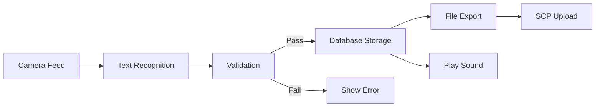

# Overview

A Flutter-based application for scanning, recording, and exporting MAC-like identifiers. Supports per-file record numbering, CSV export, SCP upload, and customizable settings.

## Features

- **Camera Scanning**: Scan 12-character hexadecimal device codes via camera
- **File Organization**: Store records grouped by "scan file" 
- **Sequential Numbering**: Per-file sequential numbering (`local_id`), synchronized with MAC ascending order
- **CSV Export**: Export records to CSV with columns: No (local_id), MAC, Suffix, Timestamp, Note
- **SCP Upload**: Upload CSV files via SCP protocol
- **Customizable Settings**: Configure SCP credentials & export directory
- **Version Display**: Show app version and author info in Settings

# Architecture



  
## Installation

1. Clone the repository
2. Run `flutter pub get`
3. Configure platform (Android/iOS) as usual
4. Launch on device/emulator

## Usage

### Creating a Scan File

- Tap **+** on **Files** page
- Enter file name and description

### Scanning Codes

- From **Files** list, select **Scan**
- Align camera to code and capture
- Records saved with auto-play confirmation sound

### Viewing History

- From **Files** list, select **View**
- Records display MAC sorted ascending or descending via the sort button
- **Reload** button resequences `local_id` to ensure continuity

### Export CSV

- On **Files** list, tap the three-dot menu next to a file and choose **Export CSV**
- Exports records sorted by MAC ascending, with `No` = `local_id` from 1…N
- Uses user-configured export directory (or app documents folder if unset)
- Shows a SnackBar with the output file path

### Upload via SCP

- Ensure **Export directory** is set in **Settings**
- In the file's menu, choose **Upload** to export and upload via SCP

## Settings

Navigate to **Settings** (gear icon in Files page):

- **OUI Prefix**: Default 6-hex prefix for new codes
- **SCP Settings**: Host, Port, Username, Password, Remote Directory
- **Export CSV Directory**: Choose folder for CSV exports


## Project Structure

```
lib/
├── core/
│   └── services/
│       ├── database_service.dart    # SQLite setup, local_id resequencing
│       ├── file_service.dart        # CSV write helpers
│       ├── scp_service.dart         # SCP upload logic
│       └── secure_storage_service.dart # Encrypted key/value store
└── features/
    └── mac_scanner/
        ├── data/
        │   ├── scan_file.dart & file_repository.dart
        │   └── scan_record.dart & scan_repository.dart
        ├── domain/
        │   ├── export_usecase.dart     # CSV export using local_id
        │   └── scan_usecase.dart       # Scan handling & audio feedback
        └── presentation/
            ├── file_list_page.dart     # File list & actions
            ├── history_page.dart       # Record view & resequence
            ├── settings_page.dart      # App settings & version/author display
            └── scanner_page.dart       # Camera scanning
```

## Database Schema

### scan_files
- `id` (Primary Key)
- `name`, `description`
- `created_at`, `updated_at`

### scan_records
- `id` (Primary Key)
- `file_id` (Foreign Key)
- `local_id` (Per-file sequential number)
- `mac`, `suffix`
- `timestamp`, `note`

## Key Technical Features

### Local ID Management
- Each file maintains its own sequential numbering starting from 1
- `local_id` is synchronized with MAC address ascending order
- Automatic resequencing fills gaps when records are deleted

### CSV Export Format
```csv
No,MAC,Suffix,Timestamp,Note
1,020000ABC123,ABC123,2025-09-15T08:55:00.000Z,
2,020000ABC124,ABC124,2025-09-15T08:56:00.000Z,Sample note
```


## Dependencies

Key Flutter packages used:
- `camera`: Camera integration for scanning
- `google_mlkit_text_recognition`: text recognition model
- `sqflite`: Local SQLite database
- `audioplayers`: Sound feedback
- `csv`: CSV export
- `flutter_secure_storage`: Encrypted credential storage
- `dartssh2`: SSH/SFTP(SCP) for uploads (dartssh2)
- `provider`: State management (choose one; here use provider for simplicity)
- `intl`: UI helpers
- `file_picker`: Directory selection for exports
- `permission_handler`: Permissnion request
- `shared_preferences`: App settings storage
- `flutter_launcher_icons`: icon support
- `package_info_plus`: App version information


## License

MIT License
