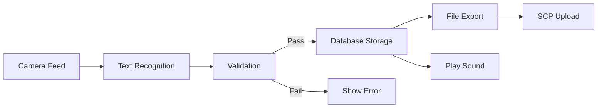

# Overview

A Flutter-based cross-platform application for scanning and managing 16-digit hexadecimal MAC addresses on Android and iOS devices. This app provides camera-based text recognition, duplicate detection, audio feedback, file export, and secure SCP file upload capabilities.

# Features

## Camera Text Recognition

- Real-time scanning of 16-digit MAC addresses using the device camera.
- Utilizes Google ML Kit Text Recognition to detect and extract text from the camera feed.

## Company Prefix Validation

- Validates the first 6 digits against a configurable company-specific prefix.
- Displays an error message if the prefix does not match.

## Duplicate Detection

- Checks the last 6 digits for duplicates to prevent redundant entries.
- Skips storage and alerts the user if a duplicate is detected.

## Audio Feedback

- Plays success and error sounds upon scan validation.
- Configurable via settings toggle to enable or disable audio cues.

## Data Management

- Uses SQLite for dynamic storage of scan records.
- Supports addition, modification, deletion, and search of individual entries.

## File Export

- Exports scan records as TXT or CSV files.
- Customizable file naming format: `YYYYMMDD_count_description.ext`.

## Secure SCP Upload

- Transfers exported files to a remote server via SCP.
- Stores server credentials securely using Flutter Secure Storage.

# Installation

```bash
# Clone the repository
git clone https://github.com/yourusername/mac-scanner-app.git
cd mac-scanner-app

# Install dependencies
flutter pub get

# Run the app
flutter run
```

# Dependencies

```yaml
dependencies:
  flutter:
    sdk: flutter
  camera: ^1.2.0
  google_mlkit_text_recognition: ^0.4.0
  sqflite: ^2.2.0
  path_provider: ^2.0.15
  audioplayers: ^2.1.0
  ssh2: ^2.0.0
  flutter_secure_storage: ^9.0.0
  csv: ^5.0.0
```

# Configuration

## Android

Add the following permissions in `android/app/src/main/AndroidManifest.xml`:

```xml
<uses-permission android:name="android.permission.CAMERA" />
<uses-permission android:name="android.permission.WRITE_EXTERNAL_STORAGE" />
<uses-permission android:name="android.permission.INTERNET" />
```

## iOS

Add to `ios/Runner/Info.plist`:

```xml
<key>NSCameraUsageDescription</key>
<string>Camera access is required for scanning MAC addresses</string>
<key>NSPhotoLibraryUsageDescription</key>
<string>Photo library access for saving scanned data</string>
```

# Usage

1. Launch the app and grant camera permissions.
2. Point the camera at a 16-digit MAC address (e.g., `ABCDEF1234567890`).
3. The app validates the prefix and duplicate status automatically.
4. On success, a green toast appears and a success sound plays.
5. Records are stored in the local database.

# Architecture



# Security

- Credentials are encrypted using Flutter Secure Storage.
- SSH/SCP connections are secured via SSH protocol.
- Input validation enforced through regex for MAC format.

# License

This project is licensed under the MIT License.
